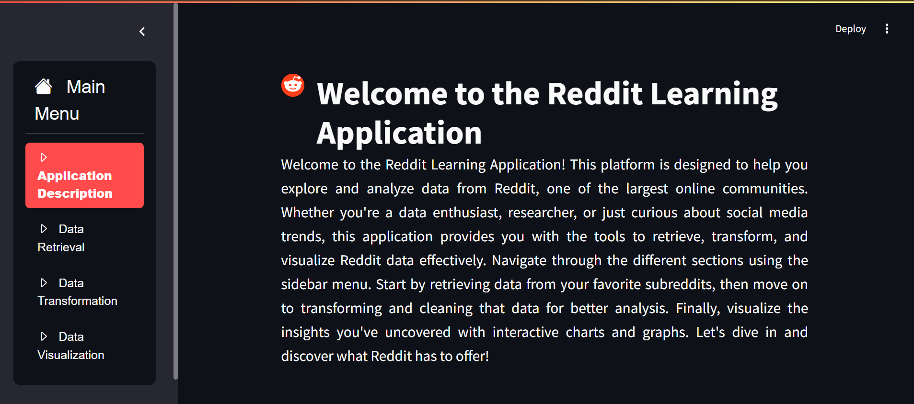

# Reddit Data Reporting Learning Application

## Overview
The Reddit Data Reporting Analysis Learning Application is an innovative platform designed to help users master the art of reporting data analysis results. This application serves both novices and seasoned analysts by providing a structured learning experience focused on effective data reporting with AI-driven feedback. Whether you're looking to improve your reporting skills or learn from real-world examples, this application is the perfect tool for your journey.

## Reddit Application Review
<div align="center">
  
</div>

### Technical Stack
- **Streamlit**: A framework for building interactive web applications in Python, enabling user-friendly interfaces with minimal coding.

- **WordCloud**: A library for visualizing word frequency in text data, creating compelling word clouds that highlight key themes.

- **Pandas**: A powerful data manipulation and analysis library that provides data structures like DataFrames for handling structured data efficiently.

- **NumPy**: A fundamental library for numerical computing in Python, offering support for large, multi-dimensional arrays and matrices.

- **Matplotlib**: A plotting library used for creating static, animated, and interactive visualizations in Python, enabling effective data presentation.

- **VADER Sentiment**: A specialized tool for sentiment analysis that determines the emotional tone of text, particularly useful for social media data.

- **NLTK**: The Natural Language Toolkit, which provides tools for working with human language data, enabling advanced natural language processing tasks.

- **Datetime**: A module for manipulating dates and times in Python, useful for handling time-related data in analysis.

- **PRAW**: The Python Reddit API Wrapper, which allows easy access to Reddit's API for fetching and analyzing Reddit data.

- **Streamlit Option Menu**: A component that enhances the Streamlit interface by providing a navigation menu for easy access to different sections of the application.

- **Google GenAI**: An integration that leverages artificial intelligence capabilities to enhance user interactions and provide intelligent feedback on reports.

## Implementation Steps
1. **API Key Retrieval**: Securely obtain the API key necessary for accessing the Reddit API.

2. **Data Fetching**: Write Python scripts to retrieve data from the Reddit API, including post information, comments, and user interactions.

3. **Data Preprocessing**: Clean and transform the fetched data to ensure consistency and usability, handling missing values and normalizing data formats. Store the processed data in JSON format.

4. **User Interface Development**: Use Streamlit to create an interactive web application that allows users to navigate through the data and submit reports.

5. **AI Feedback Integration**: Incorporate AI capabilities (using tools like LangChain or Google GenAI) to provide real-time feedback on user-generated reports, enhancing the learning experience.

6. **Version Control**: Initialize a Git repository to manage code changes, collaborate with other developers, and maintain project history.

7. **Visualization Design**: Implement visualizations within the Streamlit app to illustrate key insights from the data, such as trending topics, user engagement metrics, and sentiment analysis results.

# Features
1. **Application Description**: A brief overview of the application, highlighting its purpose and functionality in helping users analyze Reddit data.

2. **Data Retrieval**: Users can enter the desired subreddit name and specify the number of posts to retrieve, with a maximum limit of 1,000 due to retrieval speed considerations.

3. **Data Transformation**: A preview of the raw data is displayed, allowing users to review it before clicking "Clean Data" to process and sanitize the dataset. After cleaning, a preview of the transformed data is shown.

4. **Data Visualization**: Visualizations are generated based on post flair categories. Users can input a summary of the data results, and the integrated AI will provide feedback to enhance understanding and interpretation.

## Target Audience
This application is ideal for data analysts, researchers, students, and anyone interested in enhancing their data reporting skills. It provides a user-friendly interface that caters to varying levels of expertise, making it accessible for all.

## To Use the Application

1. **Clone the Repository**: Use the command `git clone <repository URL>` to download the application code to your local machine.

2. **Prepare your enviroment**: create a .env file with this format in this project structure

```yaml
client_id=Retrieve_from_Reddit_developer
client_secret=Retrieve_from_Reddit_developer
password=Your_Reddit_Account_Passowrd
user_name=Your_Reddit_Account_Username
user_agent=Agent_Name_of_Your_Choice
AI_API_KEY=Retrieve_API_key_from_Gemini
```

3. **Build the Docker Image**: Execute the command `docker build -t <image_name> .` to create a Docker image for the application.

4. **Run the Docker Container**: Start the application by running `docker run -p <port_number>:<port_number> <image_name>`, replacing `<port_number>` with the desired port for accessing the application and click the local URL.

5. **Data Retrieval**: Type in your desired subreddit name and the number of posts you would like to choose

6. **Data Transformation**: You will be shown a preview of the raw data and a button to for data cleaning, press the button to clean the data and it will show you a preview of the clean data afterwards

7. **Data Visualisation**: There will be a bunch of visualisation graphs that shows the data in different format and after analysing the graphs, there will be a text area which allows you to input the text that interprets the data. After you are done, you can click the button 'check summary' to get feedback from the AI